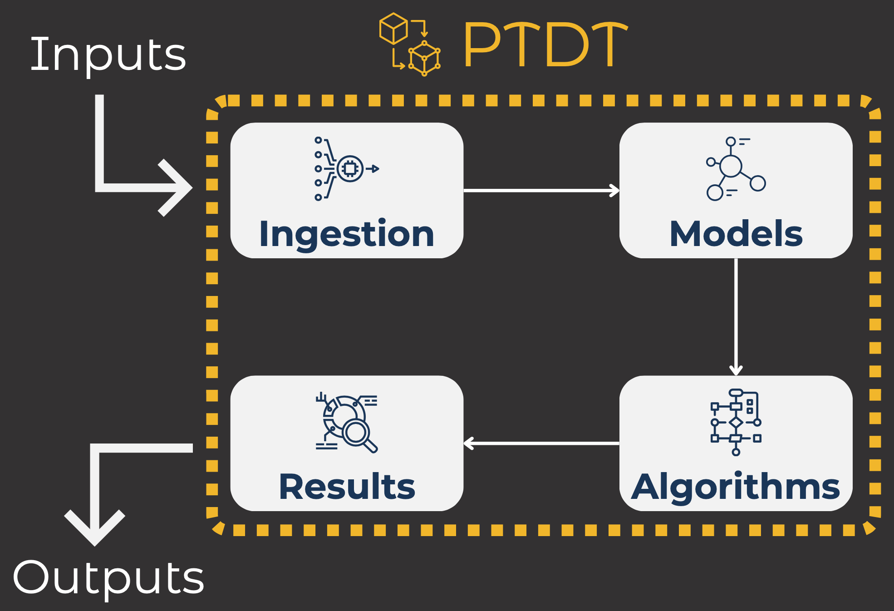
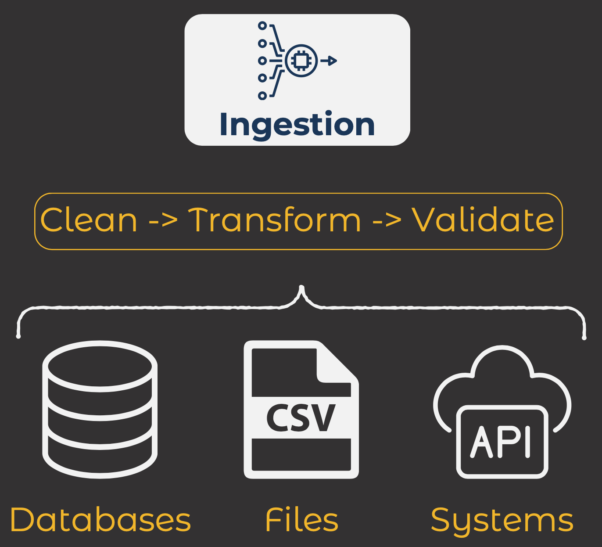
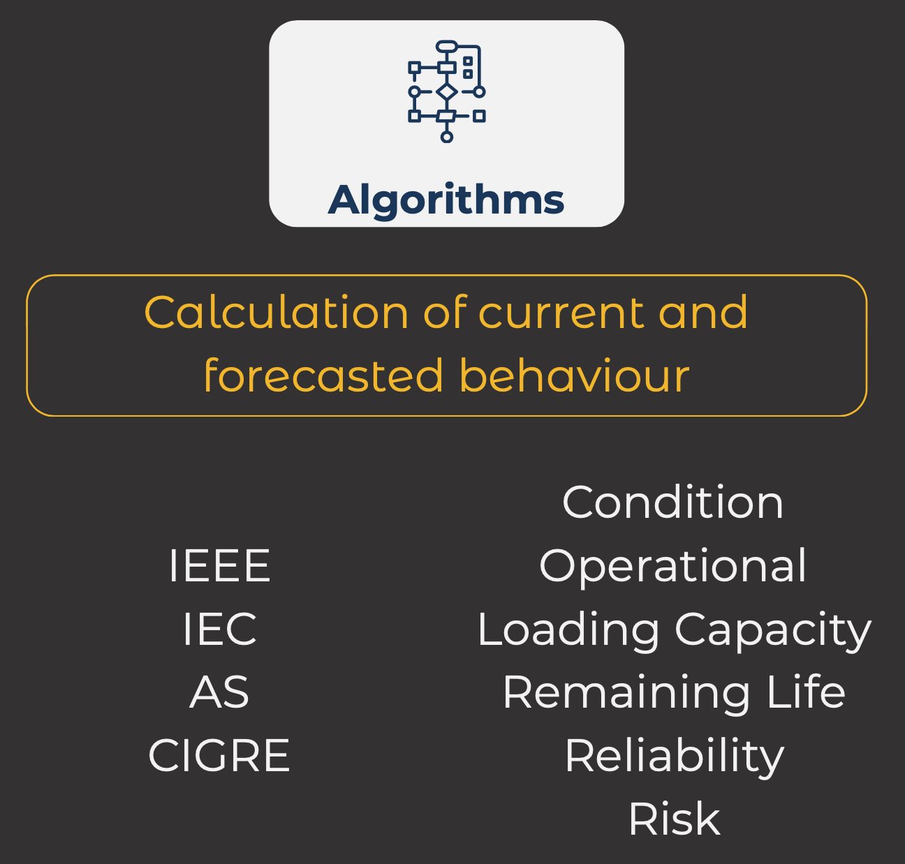
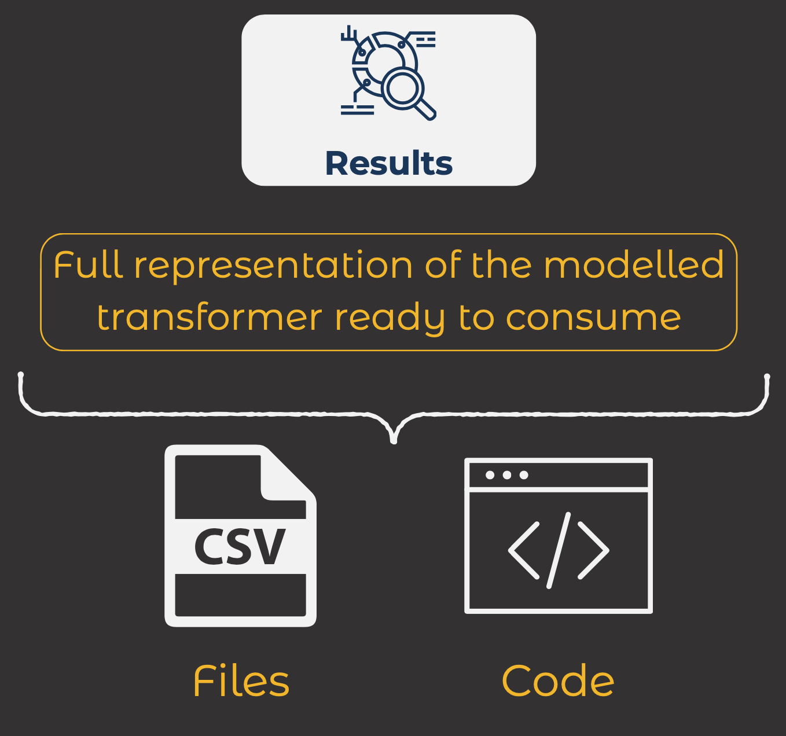

# Power Transformer Digital Twin

A project focused on creating a digital model describing the **electrical**, **mechanical**, **thermal** and **chemical** behaviour of a power transformer.

As much as possible, the algorithms in this model are based in international standards and guidelines from **IEEE**, **IEC**, and **CIGRE**.

This digital twin is fully open source distributed under the MIT license and implemented using the [e-lang engineering programming language](https://github.com/EngineersTools/e-lang).

The best way to visualise, interact and experiment with this digital twin is using a code editor, we suggest using [VSCode](https://code.visualstudio.com/) and installing the [e-lang](https://marketplace.visualstudio.com/items?itemName=EngineersTools.e-lang) extension.

A digital twin like this has many use cases in asset managment, for example:

- failure mode identification
- condition assessment
- root cause analysis
- operational decision-making

All these files are located in the [src](./src/) folder of this repository.

## Architecture

At a high level, PTDT is implemented in four main layers that allows it to interact with the external world. Both ingesting data and producing results. These layers are:

- Ingestion
- Models
- Algorithms
- Results

The following diagram illustrates these how these four layers operate as a pipeline of data flow.

A brief summary of the responsibilities of each module or layer is described below.

### Ingestion

The **ingestion** layer heps us acquire raw data, clean it up, transform it as necessary and validate it ready to be assigned to our models.

### [Models](./src/models/)

The **models** layer is incharge of specifying the data structures for all the compoments of the twin as well as more abstract (non-physical) concepts. Instances of these models will contain the data representing the current state of the power transformer.

### [Algorithms](./src/algorithms/)

The **algorithma** layer contains all the calculations, formulas, functions, rules and procedures that described the behaviour of a particular transformer.

### Results

The **results** layer prepares outputs that can be consumed by external systems, whether it be a report, a visualisation or another software system. This would be the point of integration of this digital twin to the rest of a digital asset management ecosystem.

