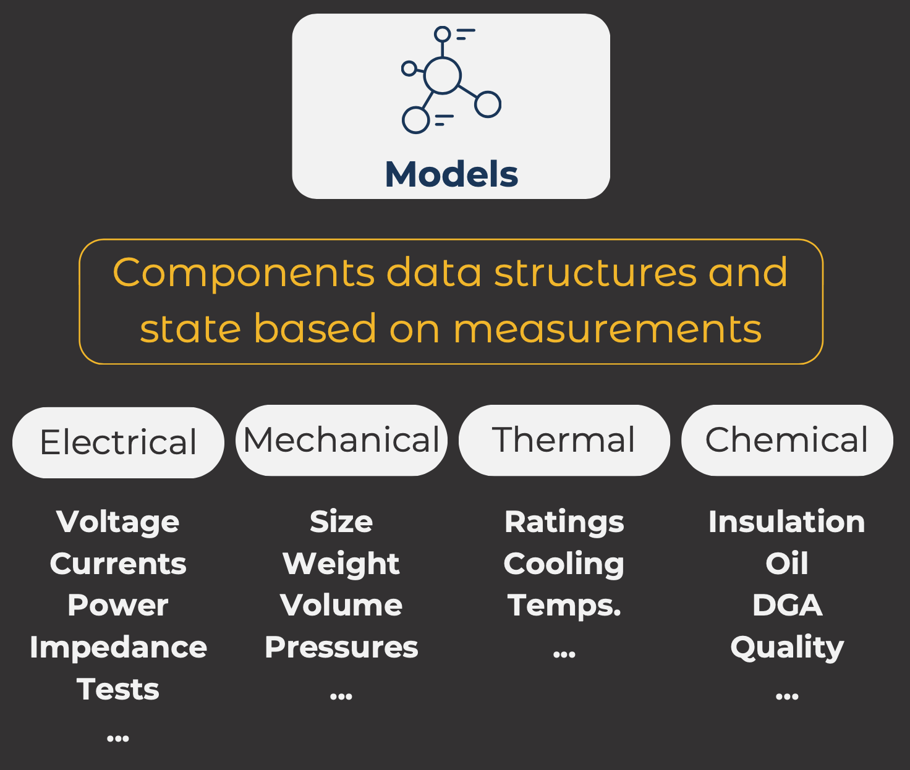

# Models

The **models** layer is incharge of specifying the data structures for all the compoments of the twin as well as more abstract (non-physical) concepts. Instances of these models will contain the data representing the current state of the power transformer.

This directory contains the data models that serve as the foundation for this Digital Twin (DT).

In this case we are building a Power Transformers Digital Twin which means many of the types are specific to this domain. However, there is a base of types that are more generic and can be used in other engineering domains.

